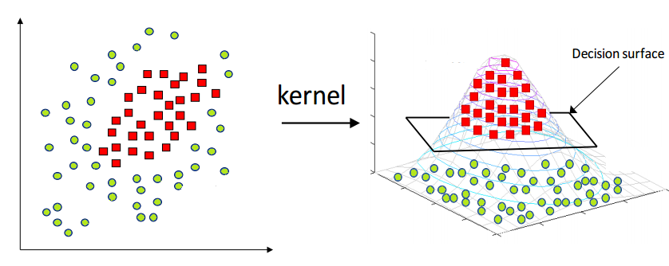

# SpMV_collab

The aim of this project is to build machine learning models that aims to predict the performance of a given architecture (CPU, GPU, FPGA) of the SpMV kernel given a set of features that describes sparce matrices.

## Dataset Info
### Experimental Setup - 9 Devices
| Device  |  Arch |  Formats |
| ------------- | ------------- | ------------- |
| Tesla-P100    | GPU           | cu-COO, cu-CSR, cu-HYB, CSR5 |
| Tesla-V100    | GPU           | cu-COO, cu-CSR, cu-HYB, CSR5 |
| Tesla-A100    | GPU           |  cu-COO, cu-CSR, Merge       |
| AMD-EPYC-64   | CPU           | Naive-CSR, CSR5, MKL-IE      |
| AMD-EPYC-24   | CPU           | Naive-CSR, Vec-CSR, AOCL, MKL-IE, SELL-C-s,Merge-CSR, CSR5, SparseX |
| INTEL-XEON    | CPU           | Naive-CSR, Vec-CSR, MKL-IE, SELL-C-s, Merge-CSR, CSR5, SparseX      |
| ARM-NEON      | CPU           | Naive-CSR, ARM-lib, Merge-CSR, SparseX, SELL-C-s                    |
| IBM-POWER9    | CPU           | Naive-CSR, Bal-CSR, Merge-CSR, SparseX                              |
| Alveo-U280    | FPGA          | Xilinx-lib                                                          |

## Running models
### MLP
Multi Layer Perceptron (MLP) is widely used in data science in order to make prediction given a set of features. Generaly speaking MLP neural network are caracterized by several features :
* Input dimension
* Output dimension
* Number of hidden layers
* Dimensions of those hidden layers

To have a better understanding of thos hyperparameters you can take a look at the following schema : 

In our model we've chosen to have an input dimension of 7 for all of these features :
* A_mem_footprint
* avg_nz_row
* skew_coeff
* avg_num_neighbours
* cross_row_similarity
* avg_bandwidth_scaled
* implementation

And an output dimension of 2 for these features :
* GFLOPs
* Energry efficiency

For further explanation of the data preprocessing see [Dataset_section](#dataset).

### SVR
Support Vector Regression (SVR) is based on Support Vector Machines (SVM). Without going into details SVM modifies dimension of our working space in order to make non-linear separable population of data separable. Then with the "Kernel trick" we project back our data in our original space. Here is a visual example :

In our project we use SVR in order to find a model by using the kernel trick to make prediction of the GFLOPs and the energy efficiency or our system given sparse matrix features
## Folders and file architectures
### Dataset
zz

### Saved models

### Models

### Main program

## How to make it work on your computer
### Adding a new model

### Running it on your computer
